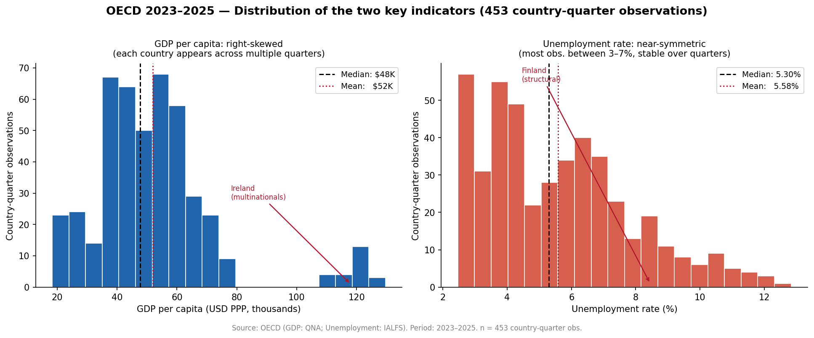
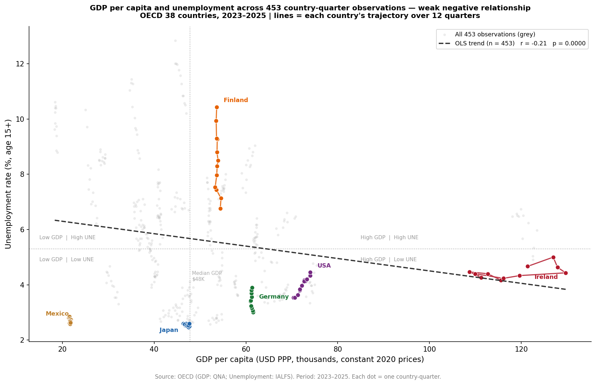
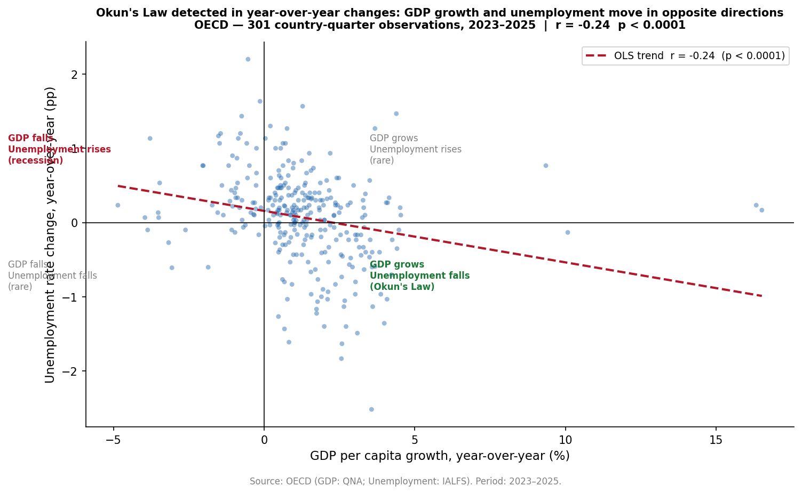
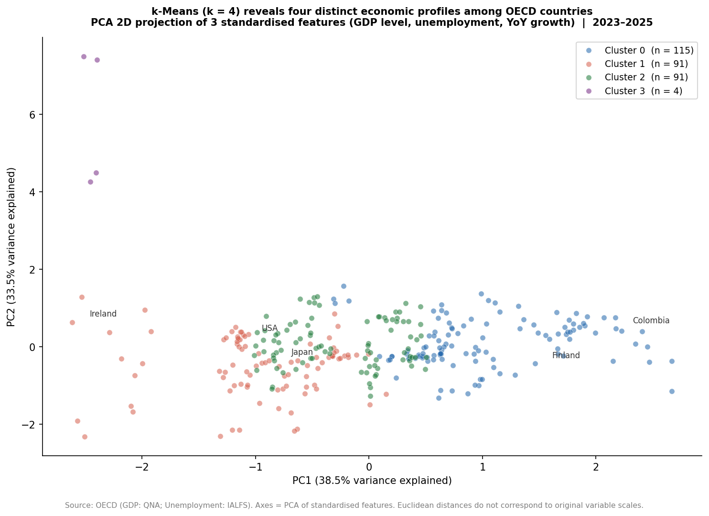
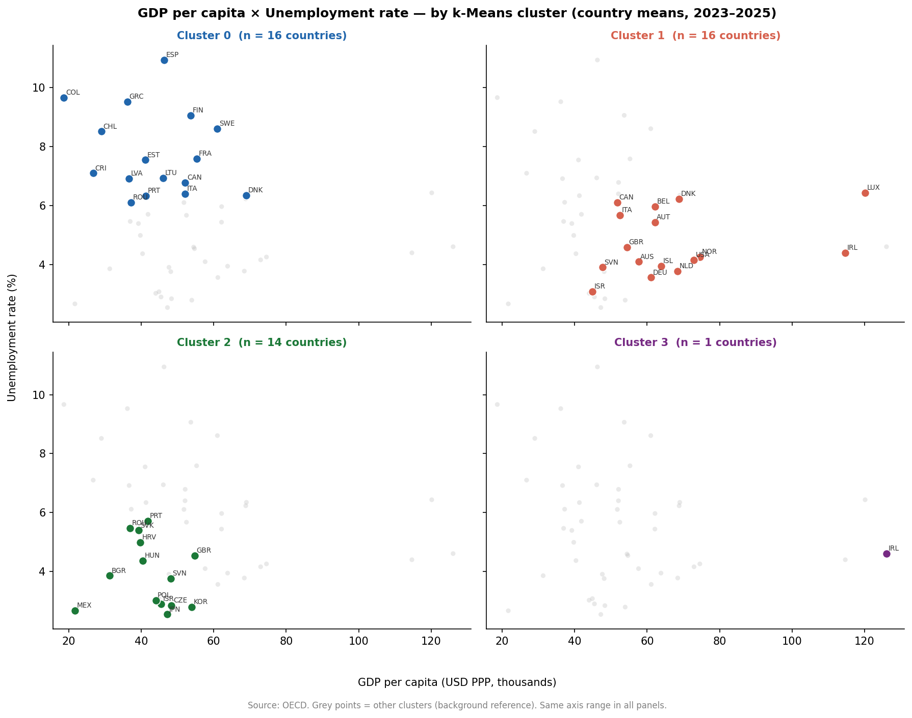
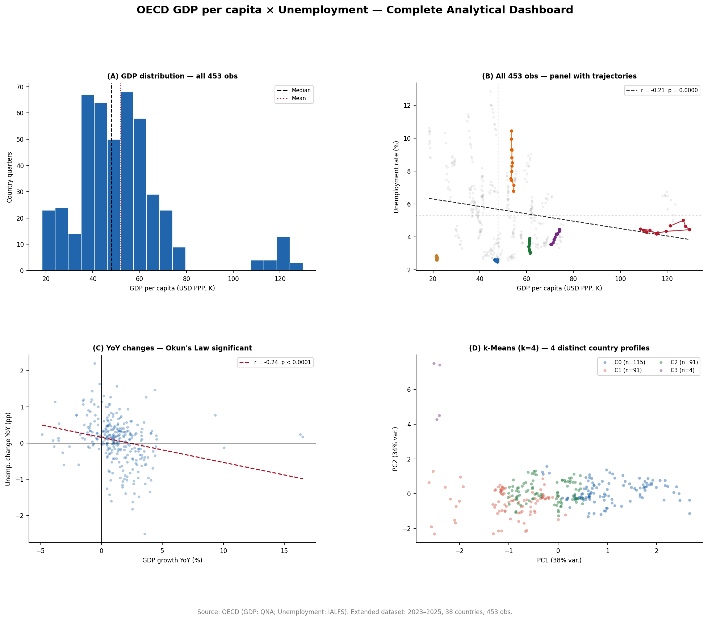

# Data Viz and Data Storytelling — Final Report
**Course:** Data Science (Optativa I) — FURB 2026  
**Lecture:** 14 — Data Viz and Data Storytelling  
**Dataset:** OECD GDP per Capita × Unemployment Rate (2023–2025)  
**Countries:** 38 OECD members | **Observations:** 453 country-quarter obs. (full panel, not averages)

---

## The Guiding Question

> *Do richer countries tend to have lower unemployment?*

This question is grounded in **Okun's Law** — one of the oldest empirical patterns in macroeconomics:  
when an economy grows, companies hire more; when it shrinks, they let people go.  
The prediction is straightforward: higher GDP per capita → lower unemployment.

We tested this using quarterly OECD data across 38 countries from 2023 to 2025.

---

## The Story Structure

Lecture 14 defines data storytelling as a narrative built from three elements:

| Element | What we use |
|---|---|
| **Data** | OECD GDP (QNA, PPP-adjusted, constant 2020 prices) + unemployment (IALFS, age 15+) |
| **Analysis** | Descriptive stats, Pearson correlation on **all 453 obs.** (panel), YoY dynamics, k-Means clustering |
| **Visualization** | 6 explanatory charts following Lecture 14 best practices |

The sequence below follows: **problem and context → analysis → conclusion.**

---

## 1 — What the Data Looks Like

*Visualization type: Explanatory + Data-driven  
Lecture 14 principle applied: **Small multiples** — same structure, same visual language, two panels.*

**What this chart shows:**

The two panels use the same visual structure side by side — a deliberate choice from Lecture 14's small multiples principle. The Y axis is "country-quarter observations" because the full panel is used: each of the 38 countries appears up to 12 times (one per quarter from 2023 to 2025). Repetition removes the cognitive cost of learning a new chart format.

**Left panel — GDP per capita (right-skewed):**
- The mean ($52K) sits noticeably above the median ($48K) — a sign of right skew
- Most observations cluster between $38,000 and $65,000 per person
- **Ireland (~$120,000–$130,000)** is the visible outlier — GDP per capita inflated by multinational corporations (Apple, Google, Meta). Does not reflect actual Irish living standards

**Right panel — Unemployment rate (near-symmetric):**
- Mean (5.58%) and median (5.30%) are close — the distribution is balanced
- Most observations fall between 3% and 7%
- **Finland (~7–10%)** is the structural outlier — not a crisis, but generous social protection enabling longer job searches
- The histogram is slightly right-tailed: a few country-quarters with 10–13% unemployment pull the tail

> *Key takeaway: GDP is unequal across OECD members. Unemployment is much more uniform. The panel view (453 obs.) shows this with full temporal granularity, not just a year-end snapshot.*

---

## 2 — The Central Finding: Does GDP Predict Unemployment?

*Visualization type: Explanatory + Data-driven  
Lecture 14 principles applied: **Preattentive attributes** (trajectory lines by country, grey background = all data), **Explanatory title that states the finding**, labeled country trajectories.*

**What this chart shows:**

Each **grey dot** is one country-quarter observation — all 453 of them, from 2023 to 2025.  
The **colored trajectory lines** trace the path of 6 key countries across all their quarters:  
Ireland, Finland, Japan, Germany, USA, and Mexico.  
The **dashed line** is the OLS trend across all 453 observations.

This is a **panel data** view: each country appears up to 12 times. The lines show how each country *moves* in GDP–unemployment space as time passes.

**The numbers (full panel, 453 obs.):**
- Pearson r = **−0.21** (p < 0.0001) — **statistically significant**
- The full panel makes the negative relationship detectable where the 2025 snapshot alone (r = −0.11, p = 0.49) could not

**Reading the trajectories:**

| Country | Trajectory pattern | What it reveals |
|---|---|---|
| Ireland (red) | High GDP, slowly shifting right and down | Structural outlier — GDP inflated by multinationals |
| Finland (orange) | Vertical drop over time | Unemployment falling fast (7→10→7%), GDP barely changes |
| Japan (blue) | Clustered at low GDP, very low UNE | Stable structural near-full employment |
| Germany (green) | Moderate GDP, rising slightly | Post-COVID recovery trajectory |
| USA (purple) | High GDP, rising slightly right | Growth with stable low unemployment |
| Mexico (brown) | Low GDP, very low UNE | Labour market structure dominates |

**Reading the quadrants:**

| Quadrant | Countries | What it means |
|---|---|---|
| High GDP, Low UNE *(bottom-right)* | USA, Norway, Germany, Korea, UK | Theory holds |
| High GDP, High UNE *(top-right)* | Finland, France, Belgium, Denmark | **Theory breaks** |
| Low GDP, Low UNE *(bottom-left)* | Japan, Mexico, Czech Republic | **Reversed expectation** |
| Low GDP, High UNE *(top-left)* | Greece, Spain, Chile, Türkiye | Theory holds |

> *Key takeaway: with all 453 obs. the correlation is now statistically significant (r = −0.21, p < 0.0001). The panel view also shows that countries move differently over time — Finland's trajectory is nearly vertical (unemployment changing, GDP stable), while Ireland's is nearly horizontal (GDP growing, unemployment stable). GDP and unemployment change at different speeds.*

---

## 3 — Okun's Law in Dynamic Changes: Even Stronger with YoY Data

*Visualization type: Explanatory + Data-driven  
Lecture 14 principles applied: **Semantic correspondence** (scatter for two continuous variables), **Context** (quadrant labels explain the mechanism), **Explanatory title with the conclusion.*

**What this chart shows:**

Each dot is one country in one quarter — comparing how much that country's GDP grew *compared to the same quarter one year earlier*, against how much its unemployment changed *compared to the same quarter one year earlier*.

This is a **dynamic view** of the same relationship. Instead of asking "does a rich country have low unemployment?", we ask "when a country's economy grows, does unemployment tend to fall?"

**The numbers:**
- Pearson r = **−0.24** (p < 0.0001) — **statistically significant**
- Based on **301 country-quarter observations** (2023–2025)

The progression from cross-section to panel to dynamics:

| Analysis | r | p-value | Significant? | N |
|---|---|---|---|---|
| 2025 only — country annual means | −0.11 | 0.49 | ❌ No | 38 |
| 2023–2025 — full panel (all obs.) | −0.21 | < 0.0001 | ✅ Yes | 453 |
| 2023–2025 — YoY growth vs change | −0.24 | < 0.0001 | ✅ Yes | 301 |

**Okun's Law is a law about *changes*, not *levels* — and it is even clearer in YoY data than in the panel level correlation.**  
The bottom-right quadrant — GDP grows, unemployment falls — is the most populated region of the chart, confirming the prediction.

> *Key takeaway: the full panel (453 obs.) already detects the negative relationship (r = −0.21, p < 0.0001). The YoY view (r = −0.24) strengthens it further by removing level differences between countries and focusing only on temporal change.*

---

## 4 — Four Distinct Country Profiles: k-Means Clustering

*Visualization type: Explanatory + Data-driven  
Lecture 14 principles applied: **Color as a function** (each cluster has a distinct color, consistent across figures), **Context** (PCA axes labelled with explained variance, projection limitation disclosed), **Visual integrity** (no distortion, method disclosed).*

**What this chart shows:**

k-Means (k = 4) was applied to three standardised features:
- `GDP_PER_CAPITA_USD_PPP` — economic wealth level
- `UNE_RATE_PCT` — labour market situation
- `GDP_GROWTH_YOY_PCT` — economic momentum (year-over-year growth)

Because three dimensions cannot be shown directly, **Principal Component Analysis (PCA)** reduces the space to two axes while preserving as much variance as possible.

> Important disclosure: the 2D position is an approximation. Cluster shapes and distances in this chart are projections, not exact measurements in the original feature space.

**How k was chosen:**  
The Elbow Method was used in unit5-machine-learning.ipynb — inertia decreases sharply from k=1 to k=4, then levels off. k = 4 was selected as the point where adding more clusters yields diminishing returns.

**What the clusters represent** (interpreted from centroids):
- Countries with high GDP and low, stable unemployment
- Countries with high GDP but higher or volatile unemployment
- Countries with moderate GDP and growing economies
- Countries with lower GDP and structural labour market challenges

> *Key takeaway: no rule-based threshold can find these groups automatically. k-Means identifies them purely from the data, using three features simultaneously. The separation between clusters confirms that country profiles are genuinely distinct.*

---

## 5 — Country Profiles Side by Side: Small Multiples

*Visualization type: Explanatory + Data-driven  
Lecture 14 principles applied: **Small multiples** — same axes across all panels, grey background for reference, colour highlights each cluster.*

**What this chart shows:**

Four panels, one per cluster. **The axes are identical across all panels** — a fundamental requirement of small multiples from Lecture 14. This allows the reader to directly compare *where* each cluster sits in GDP–unemployment space without mentally rescaling.

Grey dots in each panel show all other countries as background reference — a preattentive technique that anchors the highlighted group spatially without clutter.

**Reading across panels:**
- Each cluster occupies a different region of the space — confirming the k-Means separation was meaningful
- The country codes (ISO 3-letter) label each dot — supporting further qualitative interpretation
- No cluster is a copy of another; the four profiles are genuinely distinct

> *Key takeaway: small multiples make cluster structure immediately scannable. The reader does not need to switch chart types or mental models — only the highlighted data changes.*

---

## 6 — Summary Dashboard: All Key Findings at a Glance

*Visualization type: Explanatory + Data-driven  
Lecture 14 principles applied: **Dashboard** — centralized panel for decision support, **Cognitive efficiency** — unified colour palette and consistent labels across all four panels.*

**What this dashboard shows:**

| Panel | Finding |
|---|---|
| **(A) GDP distribution** | All 453 obs., right-skewed, Ireland outlier |
| **(B) Full panel scatter** | 453 obs. with country trajectories — r = −0.21, p < 0.0001 |
| **(C) YoY dynamics** | Statistically significant (r = −0.24, p < 0.0001); Okun's Law in changes |
| **(D) Cluster projection** | Four distinct country profiles in the PCA space |

The same colour palette is used throughout: blue for GDP, red for unemployment outliers, four distinct colours for the four clusters. This consistency reduces the cognitive effort of moving between panels — the reader does not need to re-learn the visual encoding.

> *The dashboard is designed not to summarise the charts, but to let the reader build a complete picture in one view: unequal starting points (A), full panel relationship (B), dynamic confirmation via YoY (C), and structural country heterogeneity (D).*

---

## The Conclusion

**The GDP–unemployment relationship is real but structurally masked.**

| Result | Value |
|---|---|
| 2025 only (38 annual means): Pearson r | −0.11 (p = 0.49, not significant) |
| Full panel (453 obs., 2023–2025): Pearson r | **−0.21 (p < 0.0001, significant)** |
| YoY dynamics (301 obs.): Pearson r | −0.24 (p < 0.0001, significant) |
| k-Means clusters (k = 4) | 4 distinct economic profiles |
| Countries analysed | 38 OECD members |

GDP level alone predicted unemployment poorly in a single year (r = −0.11, p = 0.49).  
Using the **full panel of 453 observations** (2023–2025), the correlation becomes statistically significant (r = −0.21, p < 0.0001).  
The YoY dynamic view (r = −0.24) confirms that Okun's Law is strongest when we measure *change*, not *level*.

Japan and Mexico have low GDP and near-zero unemployment.  
Finland has high GDP and persistently high unemployment.  
Ireland has the highest reported GDP — but it is structurally distorted by multinationals.

**The relationship is real. The panel data makes it visible. The institutional complexity of 38 different labour markets explains why it is not stronger.**

The next analytical step would be to build a predictive model using the dynamic features (YoY growth, lagged values) and cluster membership to forecast unemployment change — where the input is trajectory, not just a GDP snapshot.

---

## Lecture 14 Best Practices — Applied Checklist

| Principle | Status | Where applied |
|---|---|---|
| Clarity first — no chart junk (no 3D, no gradients, no shadows) | ✅ | All 6 figures |
| Semantic correspondence (right chart type for the variable type) | ✅ | Histograms for distributions, scatter for relationships |
| Visual integrity (no truncated axes, no distorted proportions) | ✅ | All axes zero-anchored or PCA projection disclosed |
| Cognitive efficiency (consistent palette, minimal legend effort) | ✅ | Same 4 cluster colors across Figs 4, 5, 6 |
| Context always present (source, units, time period) | ✅ | Footer caption on every figure |
| Preattentive attributes used purposefully | ✅ | Red for Ireland outlier (Fig 2), contrast trend line (Fig 3) |
| Small multiples applied correctly | ✅ | Distributions side-by-side (Fig 1), 4-panel clusters (Fig 5) |
| Explanatory titles that state the analytical finding | ✅ | All figure titles (e.g. "Okun's Law detected in YoY changes") |
| Data story structure: problem → analysis → conclusion | ✅ | This document |
| Exploratory vs explanatory distinction made explicit | ✅ | Section 3 of the notebook taxonomy |

---

*Source: OECD Data Explorer — GDP per Capita (QNA, expenditure approach, PPP-adjusted, constant 2020 prices) and Unemployment Rate (IALFS, ILO definition, age 15+, seasonally adjusted). Data retrieved April 2026.*
